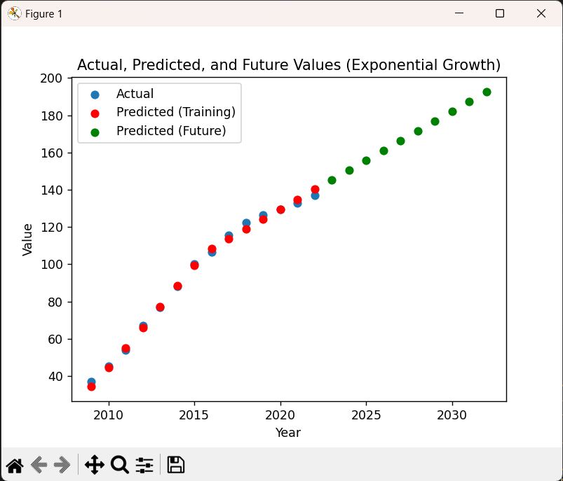

---
# House Price Prediction

## Overview

The "House Price Prediction" project is a Python-based application that utilizes TensorFlow for machine learning and artificial intelligence to predict house prices for upcoming years based on historical data. The model is compiled using Mean Squared Error as the loss function.

## Data Source

The project uses data from the `house.csv` file, where the 'TIME' (year) and 'Value' (price at that year) are extracted using the pandas library.

## Dependencies

- Python
- TensorFlow
- Pandas
- Matplotlib (Pyplot)
- Numpy
- Scikit-learn (Min Max Scaler)

## Installation

1. Clone the repository:

    ```bash
    git clone https://github.com/ReddySruthi04/House-Price-Prediction.git
    ```

2. Install dependencies:

    ```bash
    pip install tensorflow pandas matplotlib numpy scikit-learn
    ```

## Usage

1. Ensure you have the necessary dependencies installed.
2. Run the script:

    ```bash
    python house_price_prediction.py
    ```

3. View the output in the console and the generated graph.

## File Structure

- `house.csv`: Input data file containing historical house prices.
- `house_price_prediction.py`: Python script for training the TensorFlow model and predicting house prices.
- `README.md`: Project documentation.

## Implementation Details

The machine learning model is trained using TensorFlow, with Mean Squared Error as the loss function. The predictions are visualized using Matplotlib's pyplot library, both in the console and through a generated graph.

## Example Output



```
Year: 2022, Predicted Price: ₹XXXXXX
Year: 2023, Predicted Price: ₹XXXXXX
Year: 2024, Predicted Price: ₹XXXXXX
...
```
---
